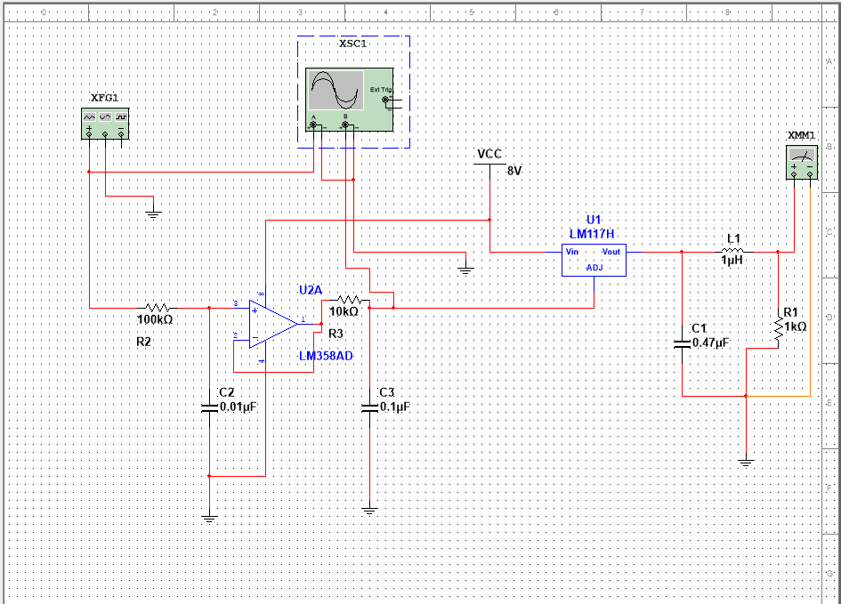
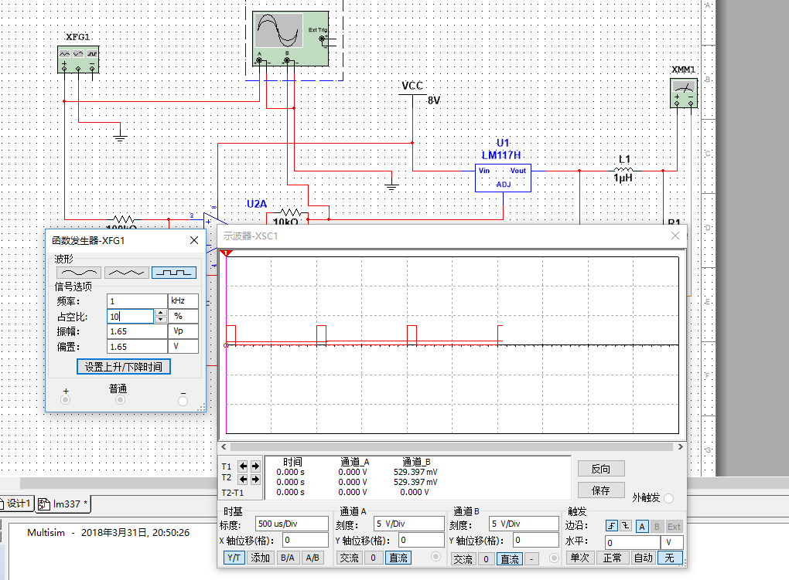
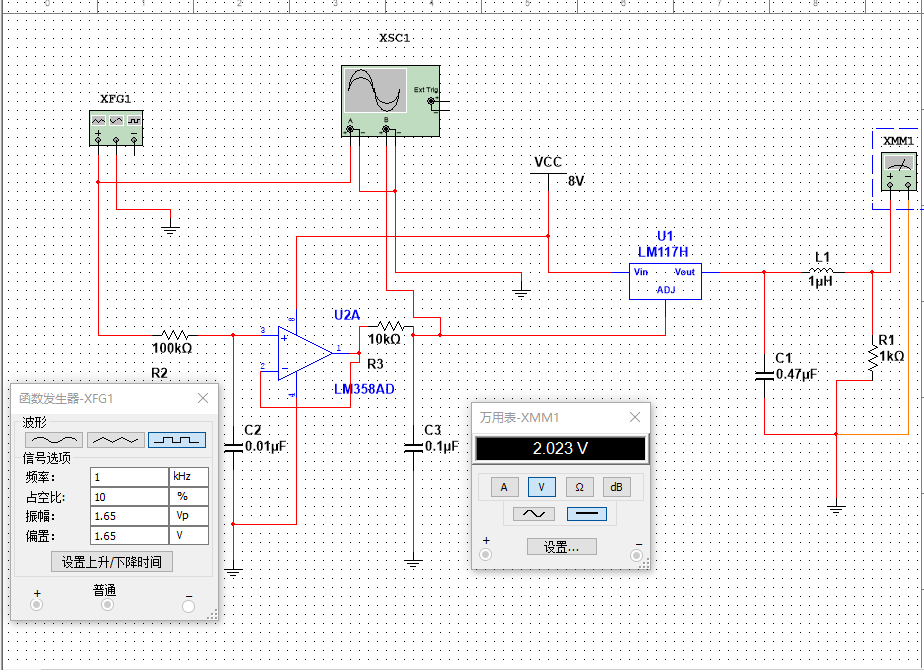
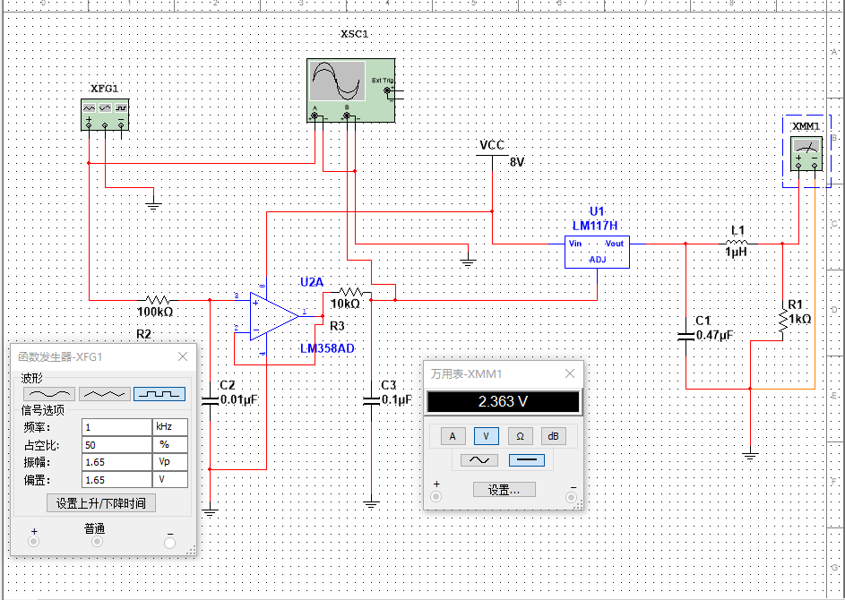
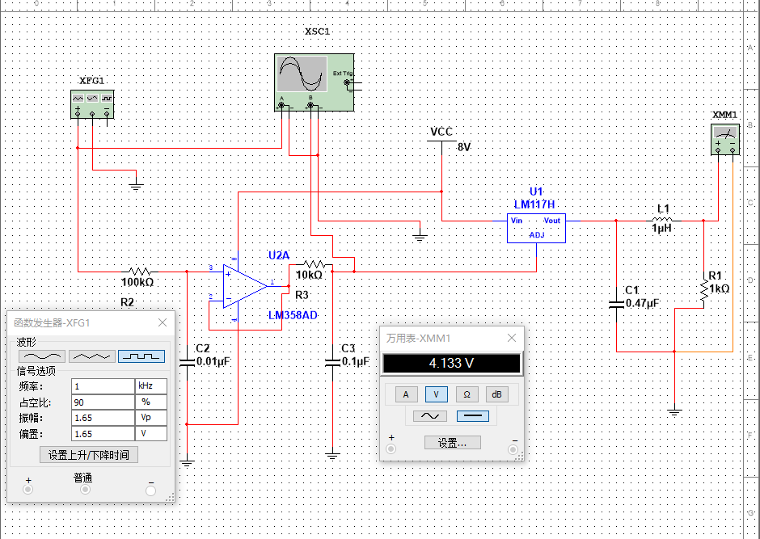
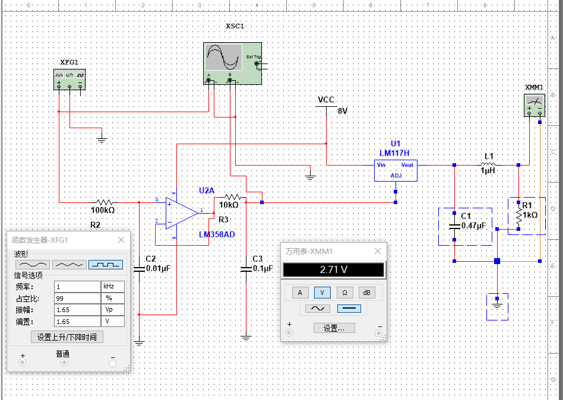

# 电路图及仿真     
              
## 完整实验电路仿真图          
      
                  
               
                     
## 不同占空比情况       
               
* 占空比10%        
                 
       
                       
* 占空比30%               
            
                
* 占空比50%                  
                  
         
                 
* 占空比70%              
                   
          
                  
* 占空比90%             
                 
         
               
* 占空比100%                
                           
        
                  
# 实验数据及分析                
                 
## 实验数据
               
|占空比(%)|仿真数据(V)|实验数据(V)|       
|:---------:|:-----------:|:-----------:|          
|10|2.023|2.280|             
|30|2.111|2.820|              
|50|2.363|3.430|             
|70|3.881|4.040|           
|90|4.133|4.660|            
|100|2.710|5.070|              

## 结果分析           
            
- 仿真中负载两端电压均会缓慢上升，占空比70%和90%时电压上升较其他占空比明显加快，并会在短暂上升后趋于稳定。图示中电压表示数除70%和90%示数为稳定示数外，其他均为正处于上升阶段的数据。                
               
- 另仿真中测得100%占空比时稳定负载电压约为5.0V。            
                 
# 设计思路              
## 流程图             
        pwm->rc->电压跟随器->rc->lm317->lc->Ro             
                       
## 关键点               
* pwm通過多阶低通获得直流                 
* 如果不加电压跟随器,输出电压会下降的厉害                  
* lm317的特性是out和adj相差1.25V,利用这个特性,改变adj的电压就是改变输出电压    
* 最后的电感电容主要滤的是lm317内部产生的交流信号           
             
## 问题                
* 二阶滤波开路输出，电压和占空比的关系满足预期，但是后级连上lm317后会产生一个0.5V左右的偏置，不知道为什么                    
* 负载为２个10ohm电阻串联的时候，电压会下降0.2左右，怀疑是lm317过热保护，有条件可以加一个散热片试试              

## 代码
```c
#include<msp430g2553.h>
int main( void )
{
  // Stop watchdog timer to prevent time out reset
  WDTCTL = WDTPW + WDTHOLD;
        volatile int i=-1;
        DCOCTL = CALDCO_1MHZ;
        BCSCTL1 = CALBC1_1MHZ;//MCLK SMCLK=1MHZ
    TACTL=TASSEL_2+TACLR;//SMCLK,
    CCR0=2000;//PWM周期
    CCTL1=OUTMOD_7;
    CCR1=1000;//384/512=0.75
    P1DIR|=BIT2;
    P1SEL|=BIT2;
    TACTL|=MC_1;//增计数模式
    while(1)
    {
                if(i==3) i=0;
                else i+=1;

                switch(i)
                {
                        case 0:
                                CCR1 = 880;
                                break;
                        case 1:
                                CCR1 = 1450;
                                break;
                        case 2:
                                CCR1 = 2000;
                                break;
                }

                __delay_cycles(10000000);
    }
  return 0;
}
```
